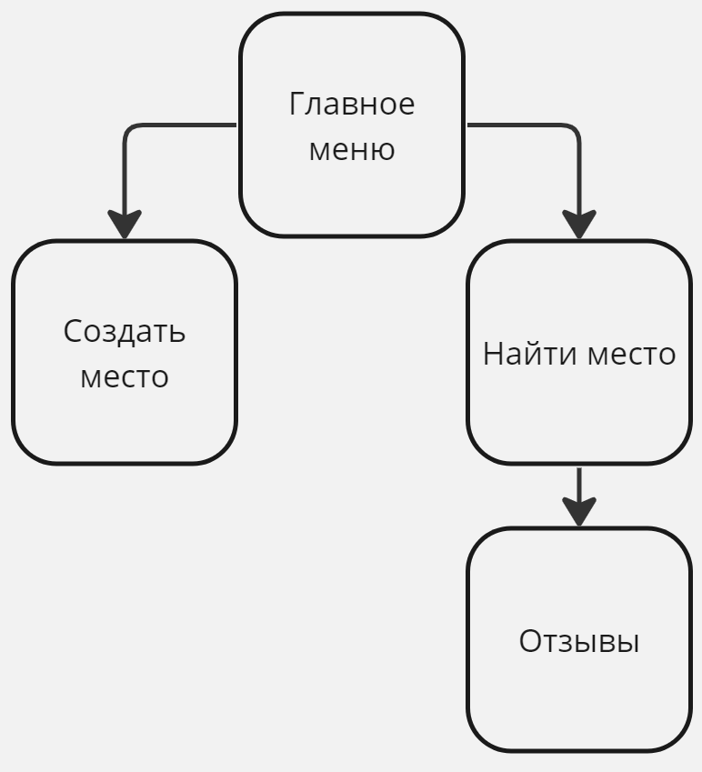

# Техническое задание
Что? Где? Куда?

## Сведения о команде
- Андрианов Вячеслав (aka STRETAL45)

## Концептуальная модель
Бот-справочник достопримечательностей, ресторанов и множество других мест в вашем городе. Пользователи сами создают страницы нужных им 
мест, оставляют свои отзывы и делятся впечатлениями, чтобы помочь людям найти интересное или нужное место. 

Компоненты продукта: база мест, база отзывов, созда.

## Функциональная карта

## Путь пользователя

## Пользовательский интерфейс

## Программные интерфейсы

    

Обработчики:

